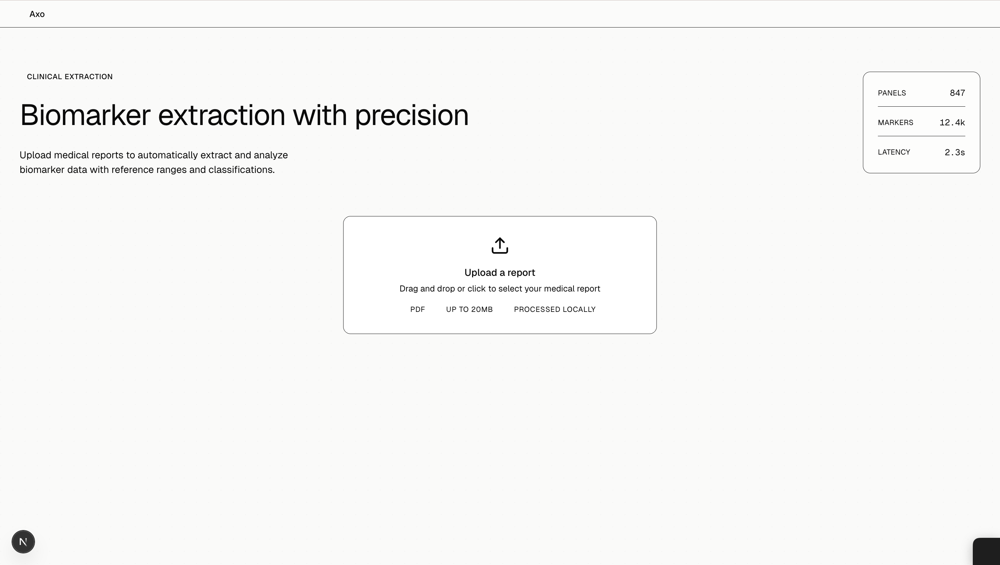
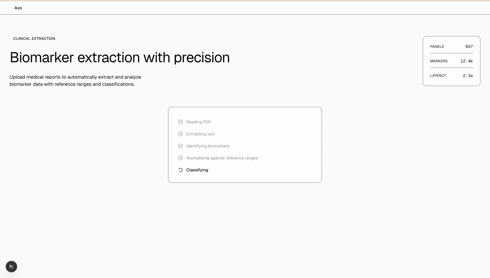
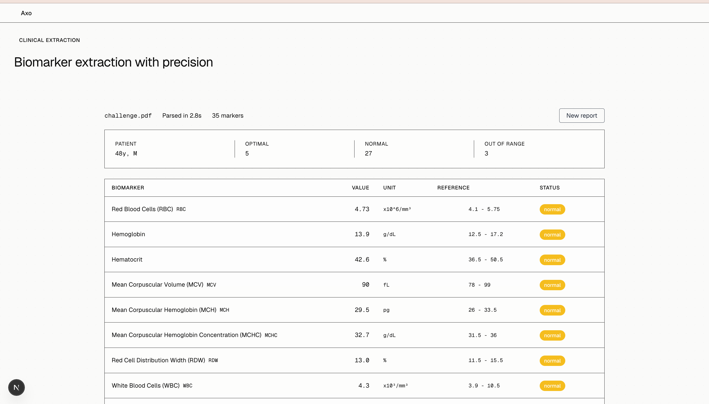
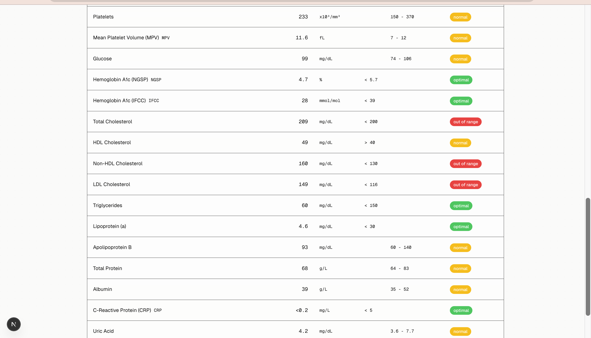

# Axo Biomarker Extraction Tool

A Next.js 14 web application that extracts, standardises, and classifies biomarker data from medical report PDFs using Anthropic's Claude AI. Built as a technical challenge submission for Axo Longevity.

---

## Overview

Medical lab reports come in many formats and languages. This tool allows a user to upload any PDF lab report, and automatically:

- Extracts all biomarker results (name, value, unit, reference range)
- Standardises biomarker names and units into English
- Classifies each result as **optimal**, **normal**, or **out of range** based on the patient's age and sex found in the report
- Displays a structured, colour-coded summary

The application uses Claude's native PDF reading capability rather than traditional text extraction libraries, which allows it to handle encrypted, compressed, and complex PDF layouts that parsers like `pdf-parse` cannot process.

---

## Screenshots

### Upload Screen


The landing page presents a clean drag-and-drop upload interface. Users can select or drop any PDF medical report.

### Processing Steps


An animated step-by-step processing indicator shows the stages of analysis: reading the PDF, extracting text, identifying biomarkers, normalising against reference ranges, and classifying results.

### Results View



Results are displayed in a structured table with colour-coded classification badges. A summary bar at the top shows the patient's age and sex alongside counts of optimal, normal, and out-of-range markers.

### Real-World Report (Spanish)
.png)

The tool correctly processes real-world reports including those written in other languages. This example shows a Spanish-language Eurofins lab report — all biomarker names and units are automatically translated to English.

---

## Features

- **Native PDF processing** via Claude's document API — no external PDF parsing library
- **Multilingual support** — standardises biomarker names and units from any language into English
- **Patient-aware classification** — uses the patient's age and sex from the report to contextualise results
- **Three-tier classification system**: optimal (green), normal (amber), out of range (red)
- **Animated processing UI** with step-by-step progress feedback
- **Summary bar** showing total counts per classification category
- **New report** button to reset and upload another file without refreshing
- **Robust JSON parsing** with fallback handling for truncated or malformed responses

---

## Tech Stack

| Layer | Technology |
|---|---|
| Framework | Next.js 14 (App Router) |
| Language | TypeScript |
| Styling | Tailwind CSS 4 |
| AI | Anthropic Claude claude-sonnet-4-6 |
| Icons | Lucide React |
| PDF Processing | Claude native document reading (base64) |

---

## Project Structure

```
src/
├── app/
│   ├── page.tsx               # Main application interface
│   ├── layout.tsx             # Root layout and metadata
│   ├── globals.css            # Global styles and design tokens
│   └── api/
│       └── extract/
│           └── route.ts       # POST endpoint — PDF upload and Claude processing
├── components/
│   ├── FileUpload.tsx         # Drag-and-drop upload with animated processing steps
│   └── ResultsTable.tsx       # Colour-coded biomarker results table
└── types/
    └── biomarker.ts           # TypeScript interfaces for Patient, Biomarker, BiomarkerResult
```

---

## How It Works

### File Processing Flow

```
1. User uploads PDF
        ↓
2. File validated (PDF only, checked by MIME type)
        ↓
3. PDF buffer converted to base64 string
        ↓
4. Base64 PDF sent to Claude API as a native document block
        ↓
5. Claude reads the PDF natively and returns structured JSON containing:
   - Patient age and sex
   - All biomarkers with name, value, unit, reference range
   - Classification for each biomarker (optimal / normal / out of range)
        ↓
6. Response cleaned (markdown fences stripped), JSON parsed
        ↓
7. Classification fields normalised to lowercase strings
        ↓
8. Results returned to frontend and rendered in the results table
```

### Why Native PDF Processing?

Traditional PDF text extraction libraries such as `pdf-parse` work by reading uncompressed text streams from the PDF binary. Many real-world lab reports — including the challenge PDF — use compressed fonts (`CIDFontType0C`) and FlateDecode streams that these libraries cannot decode. The extracted text is garbled binary data rather than readable content.

By converting the PDF to base64 and sending it directly to Claude using the `document` content block type, the AI reads the rendered PDF as a human would — extracting meaning from the visual layout rather than the raw binary stream. This approach is more reliable, handles a wider range of PDF formats, and requires significantly less code.

```typescript
// API route — core processing logic
const base64PDF = Buffer.from(await file.arrayBuffer()).toString('base64');

const response = await anthropic.messages.create({
  model: 'claude-sonnet-4-6',
  max_tokens: 8000,
  messages: [{
    role: 'user',
    content: [
      {
        type: 'document',
        source: {
          type: 'base64',
          media_type: 'application/pdf',
          data: base64PDF,
        },
      },
      {
        type: 'text',
        text: EXTRACTION_PROMPT,
      },
    ],
  }],
});
```

### Classification Logic

Claude is instructed to classify each biomarker independently based on where the value falls within the reference range:

- **Optimal**: Value falls well within the midrange of the reference interval — away from both boundaries
- **Normal**: Value is within the reference range but closer to one of the boundaries
- **Out of range**: Value falls outside the reference range entirely

Claude is explicitly instructed to ignore any existing status or classification column present in the document and to independently assess each value.

---

## Getting Started

### Prerequisites

- Node.js 18+
- An Anthropic API key ([get one here](https://console.anthropic.com))

### Installation

```bash
# Clone the repository
git clone https://github.com/usiere/axo-biomarker.git
cd axo-biomarker

# Install dependencies
npm install

# Set up environment variables
cp .env.local.example .env.local
# Add your Anthropic API key to .env.local
```

### Environment Variables

```bash
# .env.local
ANTHROPIC_API_KEY=your_api_key_here
```

### Running Locally

```bash
npm run dev
```

Open [http://localhost:3000](http://localhost:3000) in your browser.

### Building for Production

```bash
npm run build
npm start
```

---

## Cloud Deployment Architecture

While deployment is not required for this submission, the following AWS architecture would be used for a production deployment:

```
User Browser
     │
     ▼
CloudFront (CDN)
     │
     ├──► S3 Bucket (Static Next.js frontend assets)
     │
     └──► API Gateway
               │
               ▼
          Lambda Function
          (Next.js API route — /api/extract)
               │
               ▼
          Anthropic Claude API
```

### AWS Services

| Service | Purpose |
|---|---|
| **S3** | Hosts the static Next.js frontend build output |
| **CloudFront** | CDN distribution for low-latency global delivery of frontend assets |
| **API Gateway** | HTTP endpoint routing for the `/api/extract` POST route |
| **Lambda** | Serverless execution of the PDF extraction and Claude API call |
| **IAM** | Role-based access control for Lambda to call external APIs securely |
| **Secrets Manager** | Secure storage and retrieval of the `ANTHROPIC_API_KEY` |

### Deployment Notes

- The Lambda function would be configured with a **60-second timeout** to accommodate Claude API response times for large PDFs
- **Memory**: 512MB minimum recommended for base64 PDF conversion of large files
- **API Gateway payload limit**: 10MB maximum — sufficient for typical lab report PDFs
- For higher throughput, the architecture could be extended with an **SQS queue** to handle concurrent PDF processing jobs asynchronously

---

## API Reference

### POST `/api/extract`

Accepts a PDF file and returns structured biomarker data.

**Request**

```
Content-Type: multipart/form-data
Body: { file: <PDF file> }
```

**Response**

```json
{
  "patient": {
    "age": 48,
    "sex": "male"
  },
  "biomarkers": [
    {
      "name": "Hemoglobin",
      "value": "13.9",
      "unit": "g/dL",
      "reference_range": "12.5 - 17.2",
      "classification": "normal"
    },
    {
      "name": "Total Cholesterol",
      "value": "209",
      "unit": "mg/dL",
      "reference_range": "< 200",
      "classification": "out of range"
    }
  ]
}
```

**Error Response**

```json
{
  "error": "Failed to process PDF",
  "details": "Error message here"
}
```

---

## Sample Test File

**challenge.pdf** — A real-world Spanish-language Eurofins lab report (provided as part of the challenge). Tests multilingual extraction and standardisation.


---

## Design Decisions

**No external PDF library**: Traditional parsers fail on compressed or encrypted PDFs. Claude's native document reading is more robust and requires zero additional dependencies.

**max_tokens set to 8000**: Comprehensive lab reports can contain 40+ biomarkers. Earlier versions with lower token limits caused truncated JSON responses and parse failures. 8000 tokens comfortably handles the largest reports tested.

**Static Tailwind class names**: Tailwind's production build purges any CSS class not present as a complete string in the source. Dynamic class construction (e.g. `bg-${colour}-500`) is stripped. All badge styles use complete static class strings resolved via a lookup object.

**Classification normalisation on the API route**: Claude occasionally returns classification values with varying capitalisation or wrapped in nested objects depending on the PDF content. A normalisation step on the server ensures the frontend always receives a consistent lowercase string.

---

## Author

Moses Akpabio — [linkedin.com/in/usiereakpabio](https://linkedin.com/in/usiereakpabio) — [github.com/usiere](https://github.com/usiere)